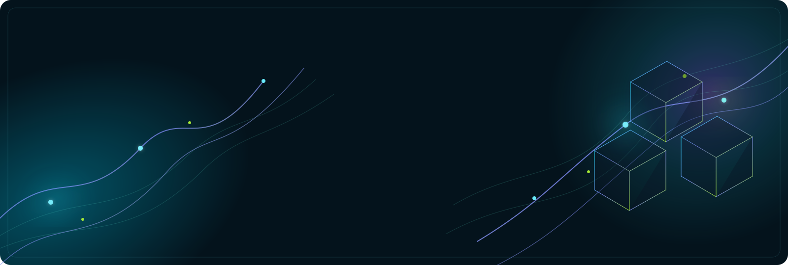

  

# Ayush Bajaj

### Software Developer · Applied AI · Full-stack Systems

I turn complex inputs into useful, dependable digital products.

> **Now building** — AI tools that help people turn documents, data, and real-world questions into clear next steps.

## A builder across the stack

I work where product thinking, robust engineering, and applied AI meet. My work ranges from document intelligence and ML pipelines to agriculture platforms, weather dashboards, and interactive web experiences.

  <code>TypeScript</code> · <code>React</code> · <code>Next.js</code> · <code>Node.js</code> · <code>Python</code> · <code>Machine Learning</code> · <code>Cloud</code>

## Selected systems

<table>
  <tr>
    <td width="50%" valign="top">
      <h3>01 / Document Summary Assistant</h3>
      <strong>Document intelligence for practical decisions</strong>
        
      Upload documents or scans, choose the level of detail, and receive a structured summary, key points, and improvement suggestions. It pairs OCR with AI analysis in a focused, responsive workflow.
        
      <code>Next.js</code> <code>TypeScript</code> <code>Gemini</code> <code>OCR</code>
        
      <a href="https://document-summary-assistant-beta.vercel.app/">Live product →</a> · <a href="https://github.com/AyushBajaj7/Document-summary-assistant">Source</a>
    </td>
    <td width="50%" valign="top">
      <h3>02 / AgriConnect</h3>
      <strong>A practical platform for agricultural information</strong>
        
      A full-stack hub for mandi prices, weather, government schemes, farming tools, and an AI assistant—organised around information that farmers can actually use.
        
      <code>React</code> <code>Node.js</code> <code>Express</code> <code>MongoDB</code>
        
      <a href="https://agri-connect-gamma-one.vercel.app/">Live product →</a> · <a href="https://github.com/AyushBajaj7/AgriConnect">Source</a>
    </td>
  </tr>
  <tr>
    <td width="50%" valign="top">
      <h3>03 / WeatherVision</h3>
      <strong>Weather data made easier to read</strong>
        
      A responsive analytics dashboard that brings together atmospheric data, air quality, precipitation trends, and side-by-side city comparison.
        
      <code>JavaScript</code> <code>Python</code> <code>Weather APIs</code>
        
      <a href="https://weathervision.onrender.com/">Live product →</a> · <a href="https://github.com/AyushBajaj7/WeatherVision">Source</a>
    </td>
    <td width="50%" valign="top">
      <h3>04 / AI Speaker Avatar</h3>
      <strong>Presentations, transformed into narrated video</strong>
        
      An AI media pipeline that turns PowerPoint presentations into narrated speaker-avatar videos, connecting language generation, voice, lip-sync, and rendering.
        
      <code>Python</code> <code>FLAN-T5</code> <code>Polly</code> <code>Wav2Lip</code>
        
      <a href="https://github.com/AyushBajaj7/Avatar-for-presentation-">Source →</a>
    </td>
  </tr>
</table>

## How I approach a build

| Start with the user | Build the system | Make it real |
| :--- | :--- | :--- |
| Reduce a real problem to a clear, useful workflow. | Design the interface, data flow, and logic as one coherent product. | Deploy, document, and refine it until the work is easy to understand and use. |

  
<strong>Tools I reach for</strong>

   

  - **Frontend:** React, Next.js, TypeScript, JavaScript, responsive UI, component systems
  - **Backend & data:** Node.js, Express, REST APIs, MongoDB, MySQL
  - **Applied AI:** Python, scikit-learn, Transformers, OCR, model evaluation
  - **Cloud & media:** Vercel, Render, AWS EC2, Amazon Polly, FFmpeg

## Beyond the code

I care about systems that are clear to use, clear to explain, and resilient when the input is messy. I am currently interested in product-minded software roles and collaborations involving AI-assisted tools, data-rich interfaces, and full-stack delivery.

### Have a problem worth building well?

[Say hello](mailto:ayushbajaj215@gmail.com) · [See the portfolio](https://ayushbajaj7.github.io/Portfolio/) · [Connect on LinkedIn](https://linkedin.com/in/ayushbajaj7)

